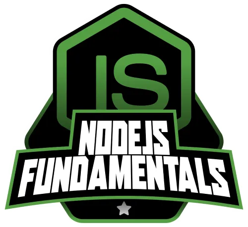

<table>
  <tr>
    <td>
      <h1>Curso Node.js Fundamentals - DIO</h1>
    </td>
    <td align="right">
      
    </td>
  </tr>
</table>

Repositório com os conteúdos, anotações, desafios e projetos desenvolvidos durante a formação **Node.js Developer** oferecida pela [DIO.me (Digital Innovation One)](https://dio.me).

---

## 🧑‍🏫 Sobre o Curso

A formação **Node.js Fundamentals** aborda os conceitos essenciais para o desenvolvimento backend com Node.js, passando por tópicos como modularização, gerenciamento de pacotes, aplicações web, criação de APIs e uso de TypeScript no ambiente Node.js.

O curso combina teoria, desafios práticos e projetos reais que simulam cenários do mercado, como e-commerce, simuladores e APIs com diferentes frameworks.

---

## 📚 Conteúdo Programático

### 🔹 Fundamentos do Node.js

- Introdução ao Node.js e seu ecossistema
- Instalação do ambiente de desenvolvimento
- Inicialização e execução de projetos
- Projeto prático: **Simulador de Corrida do Mario Kart**

### 🔹 Modularização

- Módulos CommonJS e ES Modules
- Organização de projetos em múltiplos arquivos
- Projeto prático: **Carrinho de Compras da Shopee**
- Desafio de código prático (I)

### 🔹 Gerenciamento de Pacotes (NPM)

- Uso do NPM e criação de scripts personalizados
- Variáveis de ambiente e segurança
- Projeto prático: **Gerador de QR Code para E-commerces**
- Desafio de código prático (II)

### 🔹 TypeScript para Node.js

- Supersets e tipagem estática
- Configuração de ambiente com TypeScript
- Debugging e produtividade com Node.js

### 🔹 Introdução a Aplicações Web

- Funcionamento da web e HTTP
- APIs: conceito e funcionamento

### 🔹 Criação de APIs com Node.js

- API com `http` + TypeScript: **Gerenciador de Podcasts**
- API com **Fastify**: **Minimal API da Fórmula 1**
- API com **Express**: **Champions League API**

---

## 🚀 Projetos Desenvolvidos

| Projeto | Descrição | Tecnologias |
|--------|-----------|-------------|
| 🎮 Mario Kart Race | Simulador de corridas | Node.js, `readline`, lógica |
| 🛒 Shopee Cart | Carrinho de compras com módulos | CommonJS, ES Modules |
| 🔗 QR Code Generator | CLI para gerar QR Code | Node.js, NPM, `qrcode` |
| 🎧 Podcast Manager API | API com `http` + TS | Node.js, TypeScript, HTTP |
| 🏁 Fórmula 1 API | Minimal API com Fastify | Fastify, JSON, REST |
| 🏆 Champions API | API com Express.js | Express, Node.js, TypeScript |

---

## ▶️ Como Executar os Projetos

1. Clone o repositório:

```bash
git clone https://github.com/codeguima/nodejs-fundamentals.git
```

## 🛠 Tecnologias Utilizadas

- Node.js
- JavaScript (ES6+)
- TypeScript
- NPM
- CommonJS & ES Module
- Express.js
- Fastify
- HTTP Module
- QRCode Library

## 👨‍💻 Autor
Feito por [Jhonny Guimarães]
🔗 codeguima.com.br
💼 LinkedIn

📌 Licença
Este repositório está licenciado sob a MIT License.
